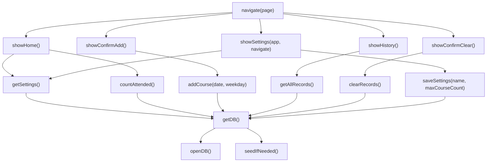

# course-quota-web 技術學習手冊

> 產生日期：2026-06-29  
> 探勘方式：使用本機 `graphify` CLI 產生 AST code graph，並交叉閱讀 `src/` 與 `openspec/specs/`。  
> 一句話：這是一個給 Cindy 使用的本機桌球課程名額追蹤 PWA，重點是「長輩友善 UI、IndexedDB 本機持久化、明確確認閘門、規格驅動維護」。

## 目錄

| 章節 | 主題 | 核心素材 |
|---|---|---|
| 1 | 專案概覽 | Vite、TypeScript、IndexedDB、Spectra |
| 2 | Graphify 探勘結果 | 810 nodes / 787 edges、核心 call graph |
| 3 | 前端頁面狀態機 | `navigate()`、`showHome()`、`showHistory()` |
| 4 | IndexedDB 資料層 | `getDB()`、`addCourse()`、`clearRecords()` |
| 5 | 設定頁模組化 | `showSettings()`、`saveSettings()` |
| 6 | 安全操作閘門 | 新增確認、清空片語閘門 |
| 7 | 長輩友善 UI 系統 | CSS tokens、48px touch target、可讀字級 |
| 8 | 規格驅動開發 | `openspec/specs/*` 與 trace |
| 9 | 工程品質與建議 | strict TS、風險點、後續測試 |

## 1. 專案概覽

### Domain

`course-quota-web` 是一個 local-only Android mobile web tool，用於追蹤 Cindy 的桌球課程上課堂數。它不依賴後端，也不做帳號登入，權威資料存在使用者裝置瀏覽器的 IndexedDB。

### 技術棧

| 類別 | 使用內容 | 說明 |
|---|---|---|
| Runtime | Browser / DOM | 單頁式前端，直接操作 DOM |
| Build | Vite 5 | `npm run dev`、`npm run build` |
| Language | TypeScript 5 | `strict`、`noUncheckedIndexedAccess`、`exactOptionalPropertyTypes` |
| Storage | IndexedDB | `settings` 與 `records` object stores |
| Spec | Spectra / OpenSpec | 規格放在 `openspec/specs/`，已歸檔變更放在 `openspec/changes/archive/` |
| PWA | Manifest + icons | `public/manifest.webmanifest` 與 icons |

### 精簡目錄樹

```text
course-quota-web/
├── src/
│   ├── main.ts
│   ├── db/db.ts
│   ├── features/settings/index.ts
│   └── styles/base.css
├── openspec/
│   ├── specs/
│   └── changes/archive/
├── public/
│   ├── manifest.webmanifest
│   └── icons/
├── graphify-out/
│   ├── graph.json
│   └── GRAPH_TREE.html
├── package.json
├── tsconfig.json
└── vite.config.ts
```

### 架構模式

這個專案採用「小型模組化 SPA」：

- `src/main.ts`：頁面 router、主要 UI render、流程控制。
- `src/db/db.ts`：IndexedDB repository/data access layer。
- `src/features/settings/index.ts`：設定頁 feature module。
- `src/styles/base.css`：設計 token 與所有 UI class。
- `openspec/specs/*`：產品規格、行為要求與驗收條件。

## 2. Graphify 探勘結果

### 執行方式

本機沒有名為 `graphify-cli` 的 binary，但有 `/Users/user/.local/bin/graphify`。因 `graphify extract` 可能將 repo 內容送到外部 LLM/API，未獲安全授權；本次改用 help 標示為 no-LLM 的本機 AST 更新：

```bash
/Users/user/.local/bin/graphify update . --no-cluster
/Users/user/.local/bin/graphify tree \
  --graph graphify-out/graph.json \
  --output graphify-out/GRAPH_TREE.html \
  --root /Users/user/Downloads/course-quota-web \
  --label course-quota-web
```

產出：

- `graphify-out/graph.json`：810 nodes、787 edges。
- `graphify-out/GRAPH_TREE.html`：graphify 可視化樹。

### Graphify 找到的核心節點

| 節點 | 來源 | Graphify 關係重點 |
|---|---|---|
| `navigate()` | `src/main.ts:25` | call 到 `showHome()`、`showConfirmAdd()`、`showHistory()`、`showConfirmClear()`、`showSettings()` |
| `showHome()` | `src/main.ts:70` | call 到 `getSettings()`、`countAttended()`、`escHtml()`、`gearSVG()` |
| `showSettings()` | `src/features/settings/index.ts:3` | 被 `navigate()` 呼叫，call 到 `getSettings()`、`saveSettings()`、`escHtml()` |
| `getDB()` | `src/db/db.ts:25` | 被所有資料操作呼叫，call 到 `openDB()`、`seedIfNeeded()` |
| `addCourse()` | `src/db/db.ts:101` | 被 `main.ts` 匯入，call 到 `getDB()` |
| `clearRecords()` | `src/db/db.ts:142` | 被 `main.ts` 匯入，call 到 `getDB()` |

### 簡化 call graph



## 3. 前端頁面狀態機

### 情境白話解釋

這個 app 沒有 React Router 或 Vue Router，而是用一個小型 `navigate(page)` 函式控制整個畫面。可以把它想成一台只有五個按鈕的簡單機器：首頁、確認新增、歷史、確認清空、設定。每次切頁時先清空 `#app`，再依 page render 對應畫面。

### 技術要點

| 技術 | 白話說明 | 為什麼用 |
|---|---|---|
| Union type `Page` | 限制合法頁面名稱 | 防止打錯 route string |
| `switch(page)` | 明確列出所有頁面 | 小 app 可讀性高 |
| `async navigate()` | 支援需要讀 IndexedDB 的頁面 | `showHome()`、`showHistory()`、`showSettings()` 都需要非同步資料 |
| `pendingDate` | 進入確認頁時凍結日期 | 避免使用者停在確認頁跨日時，畫面日期與寫入日期不一致 |
| try/catch | 導覽失敗時顯示錯誤 | 避免整頁空白 |

### STAR 口述版

**情境 (Situation)：**  
這是一個功能很聚焦的本機課程追蹤工具，頁面數少，但每個寫入動作都需要明確確認。

**任務 (Task)：**  
要用低複雜度方式管理頁面切換，同時確保新增與清空流程不能被意外觸發。

**行動 (Action)：**  
我用 TypeScript union type 定義頁面集合，集中由 `navigate()` 控制 render，並在進入 `confirm-add` 時先固定當下日期。每個頁面只註冊自己需要的事件 handler。

**成果 (Result)：**  
整體流程清楚，Graphify 顯示 `navigate()` 是主要 hub，直接連到五個畫面 render function，維護時可以很快找到每條使用者路徑。

### 追問 Q&A

**Q1：為什麼不用大型前端框架？**  
A：專案頁面與狀態都很少，資料狀態主要在 IndexedDB。直接 DOM render 可以降低依賴與部署複雜度，符合 local-only 小工具。

**Q2：`pendingDate` 為什麼不是按確認時才取？**  
A：使用者看到確認頁時，畫面已經承諾「今天是某日」。按確認時若重新取日期，可能跨日導致畫面與資料不一致。

**Q3：這種 router 的風險是什麼？**  
A：所有 HTML 都靠 template string，若資料沒有 escape 會有 XSS 風險；目前 user-controlled name/note 需要持續維持 `escHtml()` 防線。

#### 關鍵 Code Snippet

> 📂 `src/main.ts`（25-66 行）

```ts
async function navigate(page: Page): Promise<void> {
  if (page === "confirm-add") {
    const now = new Date();
    const y = now.getFullYear();
    const mo = String(now.getMonth() + 1).padStart(2, "0");
    const d = String(now.getDate()).padStart(2, "0");
    const m = now.getMonth() + 1;
    const day = now.getDate();
    const w = now.getDay();
    pendingDate = {
      iso: `${y}-${mo}-${d}`,
      weekday: w,
      label: `今天是 ${m} 月 ${day} 日 星期${WEEKDAY_ZH[w]}`,
      datePart: `今天是 ${m} 月 ${day} 日`,
      weekPart: `星期${WEEKDAY_ZH[w]}`,
    };
  }
  app.innerHTML = "";
  try {
    switch (page) {
      case "home":
        await showHome();
        break;
      case "confirm-add":
        showConfirmAdd();
        break;
      case "history":
        await showHistory();
        break;
      case "confirm-clear":
        showConfirmClear();
        break;
      case "settings":
        await showSettings(app, navigate);
        break;
    }
  } catch (err) {
    console.error("Navigation error:", err);
    app.innerHTML =
      '<p class="text-muted" style="padding:1rem">載入失敗，請重新整理頁面。</p>';
  }
}
```

逐行重點：

- `page === "confirm-add"`：只有進入新增確認頁時固定日期。
- `pendingDate.iso`：給資料層使用，格式是 `YYYY-MM-DD`。
- `pendingDate.datePart/weekPart`：給 UI 顯示使用。
- `app.innerHTML = ""`：每次導覽重新建立畫面。
- `switch(page)`：所有頁面入口集中在一處，Graphify 也能清楚辨識 call graph。
- `catch`：IndexedDB 或 render 發生錯誤時，至少讓使用者看到失敗訊息。

## 4. IndexedDB 資料層

### 情境白話解釋

IndexedDB 是這個 app 的「小型本機資料庫」。`settings` 像系統設定表，放使用者名字、目標堂數與 sequence；`records` 像上課紀錄表，保存每次上課資料。這裡最關鍵的是 `courseNumber` 永不重用，所以 sequence 不能因清空紀錄而歸零。

### 技術要點

| 技術 | 白話說明 | 為什麼用 |
|---|---|---|
| `getDB()` singleton cache | 同一個 session 重用 DB connection | 減少重複 open IndexedDB |
| `onupgradeneeded` | 建立 object stores | IndexedDB schema migration 入口 |
| `seedIfNeeded()` | 首次建立預設設定 | 首頁可直接顯示 Cindy / 100 |
| `settings.sequence` | 保存最後分配過的 `courseNumber` | 清空後也不重用序號 |
| multi-store transaction | 新增課程同時寫 `settings` 與 `records` | 確保 sequence 與 record 一起 commit |
| `records.clear()` | 只清空紀錄 store | 保留設定與 sequence |

### STAR 口述版

**情境 (Situation)：**  
課程紀錄要在瀏覽器重啟後仍存在，而且清空紀錄後，新紀錄的內部序號不能重複。

**任務 (Task)：**  
設計一個不用後端的資料層，同時支援持久化、預設設定、原子新增與安全清空。

**行動 (Action)：**  
我把 IndexedDB 分成 `settings` 與 `records` 兩個 store。新增課程時使用涵蓋兩個 store 的 readwrite transaction，先讀 `sequence`，建立 `courseNumber = sequence + 1` 的 record，再把 sequence 更新為新值。清空時只清 `records`，不碰 `settings`。

**成果 (Result)：**  
資料流與規格一致：Graphify 顯示所有資料操作都匯入 `getDB()`；OpenSpec 也明確要求 IndexedDB 是唯一權威儲存、寫入需原子化、sequence 不可重設。

### 追問 Q&A

**Q1：為什麼不用 `autoIncrement`？**  
A：規格要求 `courseNumber` 的語意由 app 控制，而且清空後仍不可重用。自行維護 sequence 可以讓語意更明確。

**Q2：新增課程為什麼要同時開 `settings` 和 `records` transaction？**  
A：新增 record 與更新 sequence 是同一個邏輯操作，若分成兩個 transaction，可能產生只寫入其中一邊的部分狀態。

**Q3：`clearRecords()` 為什麼不重設 sequence？**  
A：規格要求清空後新增不重用舊的 `courseNumber`。sequence 的語意是「最後一次已分配的序號」，不是目前 records 的最大值。

#### 關鍵 Code Snippet

> 📂 `src/db/db.ts`（100-123 行）

```ts
export async function addCourse(attendedDate: string, weekday: number): Promise<void> {
  const db = await getDB();
  return new Promise((resolve, reject) => {
    const tx = db.transaction(["settings", "records"], "readwrite");
    const settingsStore = tx.objectStore("settings");
    const recordsStore = tx.objectStore("records");
    const seqReq = settingsStore.get("sequence");
    seqReq.onsuccess = () => {
      const seq = seqReq.result as SequenceEntry;
      const courseNumber = seq.value + 1;
      recordsStore.put({
        courseNumber,
        attended: true,
        attendedDate,
        weekday,
        note: "",
      } as CourseRecord);
      settingsStore.put({ key: "sequence", value: courseNumber } as SequenceEntry);
    };
    seqReq.onerror = () => reject(seqReq.error);
    tx.oncomplete = () => resolve();
    tx.onerror = () => reject(tx.error);
  });
}
```

逐行重點：

- `db.transaction(["settings", "records"], "readwrite")`：同時鎖定兩個 store。
- `settingsStore.get("sequence")`：讀取最後一次分配過的序號。
- `seq.value + 1`：分配下一個 courseNumber。
- `recordsStore.put(...)`：寫入新的課程紀錄。
- `settingsStore.put(...)`：把 sequence 更新為已分配的新值。
- `tx.oncomplete`：等整個 transaction 完成才 resolve。

> 📂 `src/db/db.ts`（141-149 行）

```ts
export async function clearRecords(): Promise<void> {
  const db = await getDB();
  return new Promise((resolve, reject) => {
    const tx = db.transaction("records", "readwrite");
    tx.objectStore("records").clear();
    tx.oncomplete = () => resolve();
    tx.onerror = () => reject(tx.error);
  });
}
```

逐行重點：

- transaction 只開 `records`，表示清空不會碰 `settings`。
- `sequence` 不會歸零，因此後續新增會繼續往上。

## 5. 設定頁模組化

### 情境白話解釋

設定頁從主檔案拆出來，像把「個人資料編輯」做成獨立功能。首頁只知道要導向設定頁，不需要知道表單驗證細節；設定頁自己負責讀設定、渲染欄位、驗證、儲存、取消。

### 技術要點

| 技術 | 白話說明 | 為什麼用 |
|---|---|---|
| Feature module | `src/features/settings/index.ts` | 避免 `main.ts` 持續膨脹 |
| `showSettings(app, navigate)` | 外部傳入 mount point 與導覽函式 | 模組不直接依賴全域 router |
| input validation | 名稱非空、最多 50；目標堂數 1-9999 | 保護資料品質 |
| `escHtml(settings.name)` | settings value 放入 HTML 前 escape | 降低 XSS 風險 |
| save/cancel 分流 | 儲存才寫 DB，取消只回首頁 | 符合規格 |

### STAR 口述版

**情境 (Situation)：**  
MVP 後加入設定編輯功能，若全部塞在 `main.ts`，router、首頁、歷史、表單驗證會混在一起。

**任務 (Task)：**  
要把設定功能拆成可維護的 feature，同時保持小專案的簡單度。

**行動 (Action)：**  
我新增 `features/settings` 模組，讓它接收 `app` 與 `navigate`，內部自行讀取設定、渲染表單、驗證輸入與呼叫 `saveSettings()`。成功儲存後回首頁，讓首頁重新從 IndexedDB 讀最新值。

**成果 (Result)：**  
Graphify 顯示 `showSettings()` 只有清楚的六個關係：由 `navigate()` 呼叫，匯入/呼叫 `getSettings()`、`saveSettings()`、`escHtml()`、`chevronLeftSVG()`，模組邊界明確。

### 追問 Q&A

**Q1：為什麼 `showSettings()` 只允許 `navigate(page: "home")`？**  
A：設定頁目前只需要回首頁，型別收窄可避免 feature module 任意導向其他頁。

**Q2：為什麼目標堂數用 text input 而不是 number input？**  
A：行動裝置可用 `inputmode="numeric"` 叫出數字鍵盤，同時避免 number input 在不同瀏覽器上的 spinner 與格式差異。

**Q3：儲存後為什麼不用全域 store 立即更新首頁？**  
A：規格要求首頁 route entry 重新讀 IndexedDB。這讓資料來源單一，不需要額外同步機制。

#### 關鍵 Code Snippet

> 📂 `src/features/settings/index.ts`（59-88 行）

```ts
function validate(): boolean {
  let valid = true;
  const name = nameInput.value.trim();
  if (name.length === 0) {
    nameError.textContent = "名稱不可空白";
    valid = false;
  } else if (name.length > 50) {
    nameError.textContent = "名稱最多 50 個字";
    valid = false;
  } else {
    nameError.textContent = "";
  }

  const maxRaw = maxInput.value.trim();
  const maxVal = Number(maxRaw);
  if (maxRaw === "" || !Number.isInteger(maxVal) || maxVal < 1 || maxVal > 9999) {
    maxError.textContent = "請輸入 1 到 9999 之間的整數";
    valid = false;
  } else {
    maxError.textContent = "";
  }

  return valid;
}

saveBtn.addEventListener("click", async () => {
  if (!validate()) return;
  saveBtn.disabled = true;
  await saveSettings(nameInput.value.trim(), Number(maxInput.value.trim()));
  navigate("home");
});
```

逐行重點：

- `trim()`：避免空白名稱或數值。
- `Number.isInteger(maxVal)`：確保目標堂數是整數。
- `1..9999`：限制合理範圍。
- `saveBtn.disabled = true`：避免重複點擊造成重複寫入。
- 儲存成功後 `navigate("home")`：首頁重新讀取 DB 顯示最新設定。

## 6. 安全操作閘門

### 情境白話解釋

這個 app 有兩種會改資料的操作：新增上課紀錄、清空所有紀錄。新增需要確認頁，清空則需要輸入完整片語。這像是在危險按鈕前面加兩道門，避免使用者手滑。

### 技術要點

| 操作 | 防線 | 實作位置 |
|---|---|---|
| 新增紀錄 | 先進 `confirm-add`，按 `確認新增` 才寫入 | `src/main.ts:120-145` |
| 取消新增 | 回首頁，不呼叫 `addCourse()` | `src/main.ts:135-137` |
| 清空紀錄 | 從 history 入口進入 `confirm-clear` | `src/main.ts:181-182` |
| 啟用清空 | `normalize("NFC") === CLEAR_PHRASE` | `src/main.ts:245-254` |
| 執行清空 | 按鈕與 input disabled 後呼叫 `clearRecords()` | `src/main.ts:253-258` |

### STAR 口述版

**情境 (Situation)：**  
使用者可能在手機上操作，新增與清空都容易因誤觸造成資料變更，尤其清空不可復原。

**任務 (Task)：**  
要讓資料變更只來自明確意圖，並讓清空流程足夠難以誤觸。

**行動 (Action)：**  
新增流程先顯示本地日期確認頁，使用者按確認才呼叫 `addCourse()`。清空流程只能從歷史頁進入，畫面顯示不可復原警示，必須輸入 `刪除全部上課紀錄` 且 NFC 正規化後逐字相符才啟用按鈕。

**成果 (Result)：**  
OpenSpec 對新增確認與 destructive clear 有明確 scenario；程式碼也把清空與新增的 DB 寫入集中在確認後的 click handler。

### 追問 Q&A

**Q1：為什麼要用 NFC 正規化？**  
A：中文輸入法或不同系統可能產生不同 Unicode 組合，NFC 正規化讓等價字元表示更穩定。

**Q2：為什麼清空入口只放在歷史頁？**  
A：清空是針對紀錄列表的破壞性操作，從歷史頁進入語意最清楚，也避免首頁誤觸。

**Q3：按清空後為什麼要 disable input/button？**  
A：避免 transaction 尚未完成時重複觸發。

#### 關鍵 Code Snippet

> 📂 `src/main.ts`（245-258 行）

```ts
input.addEventListener("input", () => {
  clearBtn.disabled = input.value.normalize("NFC") !== CLEAR_PHRASE;
});

clearBtn.addEventListener("click", async () => {
  if (input.value.normalize("NFC") !== CLEAR_PHRASE) return;
  clearBtn.disabled = true;
  input.disabled = true;
  await clearRecords();
  navigate("home");
});
```

逐行重點：

- `input` 事件每次重新判斷片語。
- 不相符就保持 disabled。
- click handler 再檢查一次，避免只靠 UI disabled。
- 寫入前先 disable 控制項，減少重複提交。

## 7. 長輩友善 UI 系統

### 情境白話解釋

這個工具不是一般後台或密集表格，而是給特定使用者在手機上快速記錄。CSS 設計重點是大字、清楚按鈕、足夠觸控面積、明確狀態色。

### 技術要點

| 設計點 | 實作 | 說明 |
|---|---|---|
| 大字級 | `--font-size-base: 1.125rem` | body 最小 18px |
| 觸控目標 | `--tap-min: 3rem` | 48px minimum touch target |
| 色彩 token | `--color-primary`、`--color-danger`、`--color-success` | 操作語意清楚 |
| focus ring | `:focus-visible` | 鍵盤/輔助操作可辨識 |
| mobile width | `#app { max-width: 30rem }` | 手機閱讀寬度 |
| progressbar ARIA | `role="progressbar"` | 首頁進度可被輔助工具理解 |

### STAR 口述版

**情境 (Situation)：**  
使用者主要在手機上操作，且操作情境要求「看得清楚、按得準、不要誤觸」。

**任務 (Task)：**  
要建立一套簡單但一致的 UI token，讓新增、取消、清空等動作有清楚層級。

**行動 (Action)：**  
我在 `:root` 定義字級、間距、radius、語意色與 tap size，按鈕共用 `.btn-primary/.btn-ghost/.btn-danger` 基礎樣式，並使用 progressbar ARIA 與 focus-visible 提升可及性。

**成果 (Result)：**  
UI 不需要元件框架也能維持一致。規格中的 senior-friendly-ui 可直接對照到 CSS token 與 DOM 屬性。

### 追問 Q&A

**Q1：為什麼 body font-size 設 18px？**  
A：長輩友善場景下，可讀性比資訊密度重要。18px 是較穩妥的基準。

**Q2：為什麼 danger button 與 ghost danger 分開？**  
A：歷史頁的清空入口是進入流程，不是立即刪除，所以用 danger ghost；真正清空按鈕才用實心 danger。

**Q3：為什麼不使用深色模式？**  
A：目前 `color-scheme: light`，產品目標是簡單、穩定、可讀。若要支援 dark mode，應先補規格與截圖驗證。

#### 關鍵 Code Snippet

> 📂 `src/styles/base.css`（20-66 行）

```css
:root {
  color-scheme: light;

  --color-bg: #F7F2ED;
  --color-surface: #FFFFFF;
  --color-primary: #1A6FB5;
  --color-success: #15803D;
  --color-danger: #B91C1C;
  --color-text: #1C2B3A;
  --color-focus-ring: #F59E0B;

  --font-size-base: 1.125rem;
  --font-size-xl: 1.5rem;
  --font-size-4xl: 3.25rem;

  --sp-1: 0.5rem;
  --sp-4: 1.5rem;
  --sp-6: 3rem;

  --tap-min: 3rem;
  --radius-full: 9999px;
}
```

逐行重點：

- 顏色以語意命名，不以畫面位置命名。
- `--font-size-base` 直接服務可讀性。
- `--tap-min` 把觸控尺寸變成全站 token。

## 8. 規格驅動開發

### 情境白話解釋

這個 repo 不是只有程式碼，還有規格。`openspec/specs/` 描述系統必須做到什麼，`src/` 則是目前的實作。這讓維護者可以從規格理解「為什麼這段程式要這樣寫」。

### 關鍵 spec 對照

| Spec | 要求 | 對應程式 |
|---|---|---|
| `local-persistence` | IndexedDB 是唯一主資料儲存 | `src/db/db.ts` |
| `course-records` | record 五欄位、courseNumber 自動遞增、不重用 | `CourseRecord`、`addCourse()` |
| `destructive-clear` | 清空需片語閘門，且保留 settings/sequence | `showConfirmClear()`、`clearRecords()` |
| `senior-friendly-ui` | 首頁、確認頁、歷史頁要清楚可讀 | `src/main.ts`、`src/styles/base.css` |
| `user-settings` | 設定頁讀寫 IndexedDB，儲存後回首頁重新讀取 | `showSettings()`、`saveSettings()` |

### STAR 口述版

**情境 (Situation)：**  
小工具後續仍會演進，例如加設定頁、加 icon、調整清空流程。如果只靠程式碼，很容易忘記原始約束。

**任務 (Task)：**  
要讓每個需求都有可追溯的規格依據，避免改功能時破壞既有承諾。

**行動 (Action)：**  
使用 Spectra/OpenSpec 把需求拆成能力規格，包含 Requirement、Scenario 與 trace。實作時依 spec 修改，完成後歸檔 change。

**成果 (Result)：**  
Graphify 圖譜不只抽到 source code，也抽到 OpenSpec 文件節點；例如 IndexedDB、courseNumber、settings editor、destructive clear 都能從 spec 連回程式意圖。

### 追問 Q&A

**Q1：規格會不會太重？**  
A：對小 app 來說，如果未來很少改，規格可能偏重；但這個 repo 已經有多次變更與歸檔，規格能避免破壞清空/序號這類細節。

**Q2：spec 與 code 不一致時怎麼辦？**  
A：先判斷產品意圖是否變更。若意圖變更，先走 proposal/ingest 更新 spec；若 code 偏離 spec，修 code。

**Q3：Graphify 在這裡的價值是什麼？**  
A：它能快速標出 code 與 document 節點，以及 hub function。對小 repo 來說不是取代閱讀，而是加速定位。

## 9. 工程品質與建議

### 目前優點

- 架構簡單，模組邊界清楚。
- IndexedDB 寫入有 transaction 思維。
- 清空流程有片語閘門與二次檢查。
- UI token 明確，適合 mobile 與長輩友善使用。
- TypeScript 設定嚴格，能提早抓出許多錯誤。
- Spectra 規格完整，能追溯需求理由。

### 主要風險

| 風險 | 位置 | 說明 |
|---|---|---|
| Template string XSS | `src/main.ts`、`settings/index.ts` | 已有 `escHtml()`，但未來新增 user input 欄位時要記得套用 |
| 無自動測試 | repo 目前未看到 test runner | 清空、sequence、settings validation 建議補 Playwright 或 unit tests |
| IndexedDB API callback 較分散 | `src/db/db.ts` | 若資料操作變多，可考慮抽 Promise helper |
| CSS 全域集中 | `src/styles/base.css` | 小專案可接受，功能變多後需要分段管理 |
| Graphify no-LLM 圖譜語意有限 | `graphify-out/graph.json` | 自然語言 query 無語意索引，需搭配 `explain` 與原始碼閱讀 |

### 建議下一步

1. 補最小測試：
   - 新增第一筆 courseNumber 為 1。
   - 清空後 sequence 不重設。
   - settings 儲存後首頁重新讀取。
   - 清空片語不完全相符時按鈕不可用。
2. 將 `escHtml()` 集中成 shared utility，避免 `main.ts` 與 `settings/index.ts` 各自維護。
3. 若新增更多資料操作，為 IndexedDB 包一層小型 request/transaction Promise helper。
4. 若要使用 graphify semantic extraction，需要使用者明確同意外部 LLM/API 可接收 repo 內容，否則維持本機 no-LLM AST 圖譜。

## 附錄：常用指令

```bash
npm run dev
npm run typecheck
npm run build
```

```bash
/Users/user/.local/bin/graphify update . --no-cluster
/Users/user/.local/bin/graphify explain navigate --graph graphify-out/graph.json
/Users/user/.local/bin/graphify explain getDB --graph graphify-out/graph.json
/Users/user/.local/bin/graphify tree --graph graphify-out/graph.json --output graphify-out/GRAPH_TREE.html --root /Users/user/Downloads/course-quota-web --label course-quota-web
```
